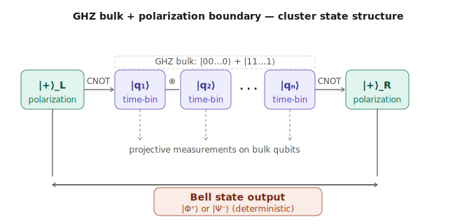
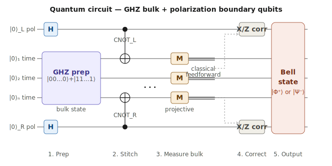

# Quantum Information Processing

A collaborative research repository exploring quantum algorithms and circuit design using [Qiskit](https://www.ibm.com/quantum/qiskit).

> **Authors:** Jinwon Yoo · [C. Praise Anyanwu](https://github.com/p-engel)

---

## Overview

This repository investigates a measurement-based quantum computation (MBQC) scheme in which a GHZ state encoded in the time-bin degree of freedom of single photons serves as a bulk resource, and two polarization qubits act as boundary nodes.

The boundary polarization qubits — each initialized in |+⟩ — are stitched to the GHZ bulk via CNOT gates, forming a hybrid entangled state with a cluster-state-like structure at the boundaries and a GHZ backbone in the bulk. Projective measurements on the bulk time-bin qubits then drive the computation. The goal is to show that an appropriate choice of measurement basis deterministically projects the two boundary polarization qubits into a target Bell state — either |Φ⁺⟩ = (|00⟩ + |11⟩)/√2 or |Ψ⁻⟩ = (|01⟩ − |10⟩)/√2 — up to known Pauli corrections from classical feedforward.

This connects to the broader framework of quantum nonlocality: the measurement outcomes on the bulk qubits exhibit nonlocal correlations, and the entanglement of the boundary photons in the polarization basis is a direct signature of this nonlocality.

---

## Figures

**Fig. 1 — State structure:** GHZ bulk (time-bin DOF) stitched to boundary polarization qubits via CNOT gates. Projective measurements on the bulk yield a deterministic Bell state at the boundaries.



**Fig. 2 — Quantum circuit:** Full gate sequence from state preparation through CNOT stitching, bulk measurement, classical feedforward, Pauli correction, and Bell state readout.



---

## Repository Structure

```
quantum-info-repo/
├── notebooks/               # Jupyter notebooks (main working environment)
│   ├── 00_qiskit_primer.ipynb       # Qiskit fundamentals & first circuits
│   ├── 01_single_qubit_gates.ipynb  # Bloch sphere, rotations, Hadamard
│   ├── 02_entanglement_bells.ipynb  # Bell states, CNOT, entanglement
│   └── 03_grover_search.ipynb       # Grover's algorithm walkthrough
├── src/                     # Reusable Python modules
│   ├── circuit_utils.py     # Helper functions for building/visualizing circuits
│   └── algorithms.py        # Modular algorithm implementations
├── docs/                    # Notes, derivations, references
│   └── resources.md         # Curated reading list
├── environment.yml          # Conda environment spec
├── requirements.txt         # pip alternative
└── README.md
```

---

## Getting Started

### 1. Clone the repository

```bash
git clone https://github.com/p-engel/quantum-info-repo.git
cd quantum-info-repo
```

### 2. Set up the environment

**With conda (recommended):**
```bash
conda env create -f environment.yml
conda activate quantum-env
```

**With pip:**
```bash
pip install -r requirements.txt
```

### 3. Launch Jupyter

```bash
jupyter lab
```

Open `notebooks/00_qiskit_primer.ipynb` to start.

---

## Dependencies

| Package | Purpose |
|---|---|
| `qiskit >= 2.0` | Core quantum circuit framework |
| `qiskit-aer` | High-performance local simulator |
| `qiskit-ibm-runtime` | Access to IBM real quantum hardware |
| `matplotlib` | Circuit and state visualization |
| `numpy` | Linear algebra, state vectors |
| `scipy` | Scientific computing utilities |
| `jupyter` | Interactive notebooks |

---

## IBM Quantum Access (Optional)

To run circuits on **real quantum hardware**, create a free IBM Quantum account at [quantum.ibm.com](https://quantum.ibm.com) and save your API token:

```python
from qiskit_ibm_runtime import QiskitRuntimeService
QiskitRuntimeService.save_account(channel="ibm_quantum", token="YOUR_TOKEN")
```

Free accounts have access to several real devices. For most algorithm development, the local **Aer simulator** is faster and sufficient.

---

## Collaboration Guide

### Branch workflow

```
main          ← stable, reviewed code only
dev           ← active development branch
feature/xxx   ← individual feature branches
```

**Typical workflow:**
```bash
git checkout dev
git pull origin dev
git checkout -b feature/my-new-circuit
# ... do work ...
git push origin feature/my-new-circuit
# Open a Pull Request into dev
```

### Adding a collaborator

The repository owner can go to:
`Settings → Collaborators → Add people` → search by GitHub username → invite.

Your collaborator will receive an email invite and, once accepted, will have push access.

---

## Roadmap

**Phase 1 — Foundations**
- [ ] Qiskit basics: circuits, gates, simulation
- [ ] Bell states and entanglement in Qiskit
- [ ] GHZ state preparation and verification

**Phase 2 — Core Construction**
- [ ] Time-bin qubit encoding in single photons
- [ ] Boundary polarization qubit initialization |+⟩
- [ ] CNOT stitching of bulk GHZ to boundary qubits
- [ ] Full hybrid state construction and simulation

**Phase 3 — MBQC Protocol**
- [ ] Projective measurement implementation on bulk qubits
- [ ] Classical feedforward and Pauli correction logic
- [ ] Deterministic Bell state output verification (|Φ⁺⟩ and |Ψ⁻⟩)

**Phase 4 — Analysis**
- [ ] Bell inequality violation tests on output state
- [ ] Scaling: vary n (number of bulk qubits) and study robustness
- [ ] Noise modeling with Aer (decoherence, gate errors)

---

## References & Learning Resources

See [`docs/resources.md`](docs/resources.md) for a curated list. Key starting points:

- [Qiskit Textbook](https://learning.quantum.ibm.com/) — free, interactive, excellent
- [IBM Quantum Learning](https://learning.quantum.ibm.com/catalog/courses) — structured courses
- Nielsen & Chuang, *Quantum Computation and Quantum Information* — the standard reference
- Preskill, [*Lecture Notes on Quantum Computation*](http://www.theory.caltech.edu/~preskill/ph229/) — free online

---

## License

MIT — see `LICENSE` for details.
